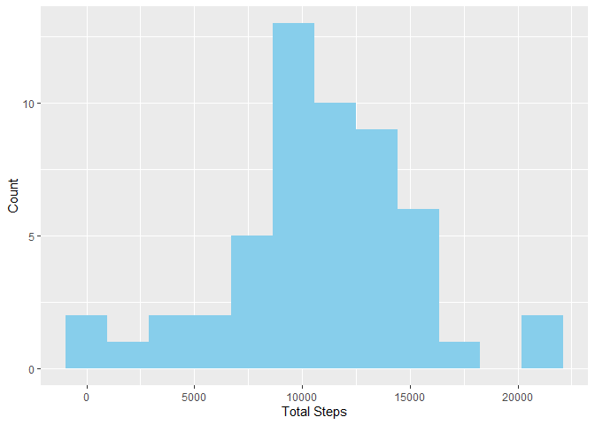
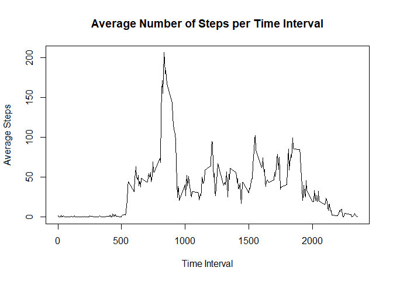
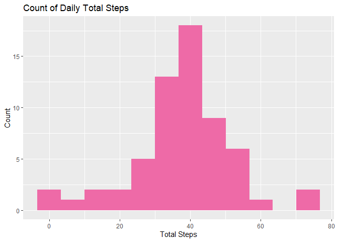
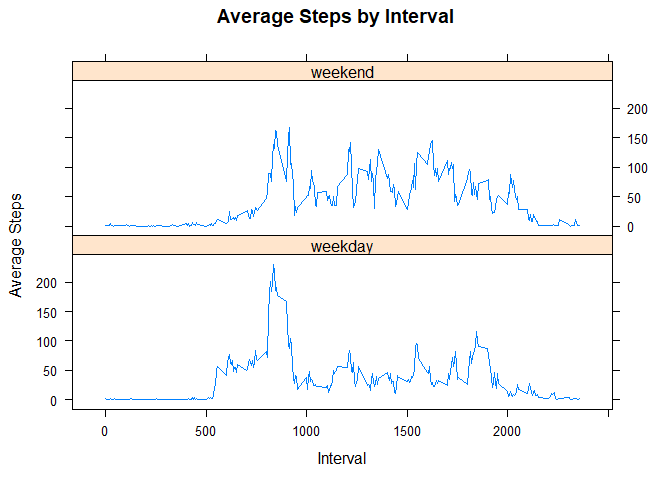

## Loading and preprocessing the data
The data is to be read in, and date is to be converted from text to date.

```r
#unzip the file
unzip("activity.zip", exdir = getwd())
rawdata <- read.csv("activity.csv", header = TRUE, na.strings = "NA")
#convert date column from factor into date
rawdata$date <- as.Date(rawdata$date, "%Y-%m-%d")
```

## What is mean total number of steps taken per day?
Calculate the total number of steps taken per day. 

Calculate and report the mean and median of the total number of steps taken per day. 


```
## Warning: package 'kableExtra' was built under R version 3.6.2
```

<table class="table" style="margin-left: auto; margin-right: auto;">
 <thead>
  <tr>
   <th style="text-align:left;"> date </th>
   <th style="text-align:right;"> median </th>
   <th style="text-align:right;"> average </th>
   <th style="text-align:right;"> total </th>
  </tr>
 </thead>
<tbody>
  <tr>
   <td style="text-align:left;"> 2012-10-01 </td>
   <td style="text-align:right;"> NA </td>
   <td style="text-align:right;"> NA </td>
   <td style="text-align:right;"> NA </td>
  </tr>
  <tr>
   <td style="text-align:left;"> 2012-10-02 </td>
   <td style="text-align:right;"> 0 </td>
   <td style="text-align:right;"> 0.4375000 </td>
   <td style="text-align:right;"> 126 </td>
  </tr>
  <tr>
   <td style="text-align:left;"> 2012-10-03 </td>
   <td style="text-align:right;"> 0 </td>
   <td style="text-align:right;"> 39.4166667 </td>
   <td style="text-align:right;"> 11352 </td>
  </tr>
  <tr>
   <td style="text-align:left;"> 2012-10-04 </td>
   <td style="text-align:right;"> 0 </td>
   <td style="text-align:right;"> 42.0694444 </td>
   <td style="text-align:right;"> 12116 </td>
  </tr>
  <tr>
   <td style="text-align:left;"> 2012-10-05 </td>
   <td style="text-align:right;"> 0 </td>
   <td style="text-align:right;"> 46.1597222 </td>
   <td style="text-align:right;"> 13294 </td>
  </tr>
  <tr>
   <td style="text-align:left;"> 2012-10-06 </td>
   <td style="text-align:right;"> 0 </td>
   <td style="text-align:right;"> 53.5416667 </td>
   <td style="text-align:right;"> 15420 </td>
  </tr>
  <tr>
   <td style="text-align:left;"> 2012-10-07 </td>
   <td style="text-align:right;"> 0 </td>
   <td style="text-align:right;"> 38.2465278 </td>
   <td style="text-align:right;"> 11015 </td>
  </tr>
  <tr>
   <td style="text-align:left;"> 2012-10-08 </td>
   <td style="text-align:right;"> NA </td>
   <td style="text-align:right;"> NA </td>
   <td style="text-align:right;"> NA </td>
  </tr>
  <tr>
   <td style="text-align:left;"> 2012-10-09 </td>
   <td style="text-align:right;"> 0 </td>
   <td style="text-align:right;"> 44.4826389 </td>
   <td style="text-align:right;"> 12811 </td>
  </tr>
  <tr>
   <td style="text-align:left;"> 2012-10-10 </td>
   <td style="text-align:right;"> 0 </td>
   <td style="text-align:right;"> 34.3750000 </td>
   <td style="text-align:right;"> 9900 </td>
  </tr>
  <tr>
   <td style="text-align:left;"> 2012-10-11 </td>
   <td style="text-align:right;"> 0 </td>
   <td style="text-align:right;"> 35.7777778 </td>
   <td style="text-align:right;"> 10304 </td>
  </tr>
  <tr>
   <td style="text-align:left;"> 2012-10-12 </td>
   <td style="text-align:right;"> 0 </td>
   <td style="text-align:right;"> 60.3541667 </td>
   <td style="text-align:right;"> 17382 </td>
  </tr>
  <tr>
   <td style="text-align:left;"> 2012-10-13 </td>
   <td style="text-align:right;"> 0 </td>
   <td style="text-align:right;"> 43.1458333 </td>
   <td style="text-align:right;"> 12426 </td>
  </tr>
  <tr>
   <td style="text-align:left;"> 2012-10-14 </td>
   <td style="text-align:right;"> 0 </td>
   <td style="text-align:right;"> 52.4236111 </td>
   <td style="text-align:right;"> 15098 </td>
  </tr>
  <tr>
   <td style="text-align:left;"> 2012-10-15 </td>
   <td style="text-align:right;"> 0 </td>
   <td style="text-align:right;"> 35.2048611 </td>
   <td style="text-align:right;"> 10139 </td>
  </tr>
  <tr>
   <td style="text-align:left;"> 2012-10-16 </td>
   <td style="text-align:right;"> 0 </td>
   <td style="text-align:right;"> 52.3750000 </td>
   <td style="text-align:right;"> 15084 </td>
  </tr>
  <tr>
   <td style="text-align:left;"> 2012-10-17 </td>
   <td style="text-align:right;"> 0 </td>
   <td style="text-align:right;"> 46.7083333 </td>
   <td style="text-align:right;"> 13452 </td>
  </tr>
  <tr>
   <td style="text-align:left;"> 2012-10-18 </td>
   <td style="text-align:right;"> 0 </td>
   <td style="text-align:right;"> 34.9166667 </td>
   <td style="text-align:right;"> 10056 </td>
  </tr>
  <tr>
   <td style="text-align:left;"> 2012-10-19 </td>
   <td style="text-align:right;"> 0 </td>
   <td style="text-align:right;"> 41.0729167 </td>
   <td style="text-align:right;"> 11829 </td>
  </tr>
  <tr>
   <td style="text-align:left;"> 2012-10-20 </td>
   <td style="text-align:right;"> 0 </td>
   <td style="text-align:right;"> 36.0937500 </td>
   <td style="text-align:right;"> 10395 </td>
  </tr>
  <tr>
   <td style="text-align:left;"> 2012-10-21 </td>
   <td style="text-align:right;"> 0 </td>
   <td style="text-align:right;"> 30.6284722 </td>
   <td style="text-align:right;"> 8821 </td>
  </tr>
  <tr>
   <td style="text-align:left;"> 2012-10-22 </td>
   <td style="text-align:right;"> 0 </td>
   <td style="text-align:right;"> 46.7361111 </td>
   <td style="text-align:right;"> 13460 </td>
  </tr>
  <tr>
   <td style="text-align:left;"> 2012-10-23 </td>
   <td style="text-align:right;"> 0 </td>
   <td style="text-align:right;"> 30.9652778 </td>
   <td style="text-align:right;"> 8918 </td>
  </tr>
  <tr>
   <td style="text-align:left;"> 2012-10-24 </td>
   <td style="text-align:right;"> 0 </td>
   <td style="text-align:right;"> 29.0104167 </td>
   <td style="text-align:right;"> 8355 </td>
  </tr>
  <tr>
   <td style="text-align:left;"> 2012-10-25 </td>
   <td style="text-align:right;"> 0 </td>
   <td style="text-align:right;"> 8.6527778 </td>
   <td style="text-align:right;"> 2492 </td>
  </tr>
  <tr>
   <td style="text-align:left;"> 2012-10-26 </td>
   <td style="text-align:right;"> 0 </td>
   <td style="text-align:right;"> 23.5347222 </td>
   <td style="text-align:right;"> 6778 </td>
  </tr>
  <tr>
   <td style="text-align:left;"> 2012-10-27 </td>
   <td style="text-align:right;"> 0 </td>
   <td style="text-align:right;"> 35.1354167 </td>
   <td style="text-align:right;"> 10119 </td>
  </tr>
  <tr>
   <td style="text-align:left;"> 2012-10-28 </td>
   <td style="text-align:right;"> 0 </td>
   <td style="text-align:right;"> 39.7847222 </td>
   <td style="text-align:right;"> 11458 </td>
  </tr>
  <tr>
   <td style="text-align:left;"> 2012-10-29 </td>
   <td style="text-align:right;"> 0 </td>
   <td style="text-align:right;"> 17.4236111 </td>
   <td style="text-align:right;"> 5018 </td>
  </tr>
  <tr>
   <td style="text-align:left;"> 2012-10-30 </td>
   <td style="text-align:right;"> 0 </td>
   <td style="text-align:right;"> 34.0937500 </td>
   <td style="text-align:right;"> 9819 </td>
  </tr>
  <tr>
   <td style="text-align:left;"> 2012-10-31 </td>
   <td style="text-align:right;"> 0 </td>
   <td style="text-align:right;"> 53.5208333 </td>
   <td style="text-align:right;"> 15414 </td>
  </tr>
  <tr>
   <td style="text-align:left;"> 2012-11-01 </td>
   <td style="text-align:right;"> NA </td>
   <td style="text-align:right;"> NA </td>
   <td style="text-align:right;"> NA </td>
  </tr>
  <tr>
   <td style="text-align:left;"> 2012-11-02 </td>
   <td style="text-align:right;"> 0 </td>
   <td style="text-align:right;"> 36.8055556 </td>
   <td style="text-align:right;"> 10600 </td>
  </tr>
  <tr>
   <td style="text-align:left;"> 2012-11-03 </td>
   <td style="text-align:right;"> 0 </td>
   <td style="text-align:right;"> 36.7048611 </td>
   <td style="text-align:right;"> 10571 </td>
  </tr>
  <tr>
   <td style="text-align:left;"> 2012-11-04 </td>
   <td style="text-align:right;"> NA </td>
   <td style="text-align:right;"> NA </td>
   <td style="text-align:right;"> NA </td>
  </tr>
  <tr>
   <td style="text-align:left;"> 2012-11-05 </td>
   <td style="text-align:right;"> 0 </td>
   <td style="text-align:right;"> 36.2465278 </td>
   <td style="text-align:right;"> 10439 </td>
  </tr>
  <tr>
   <td style="text-align:left;"> 2012-11-06 </td>
   <td style="text-align:right;"> 0 </td>
   <td style="text-align:right;"> 28.9375000 </td>
   <td style="text-align:right;"> 8334 </td>
  </tr>
  <tr>
   <td style="text-align:left;"> 2012-11-07 </td>
   <td style="text-align:right;"> 0 </td>
   <td style="text-align:right;"> 44.7326389 </td>
   <td style="text-align:right;"> 12883 </td>
  </tr>
  <tr>
   <td style="text-align:left;"> 2012-11-08 </td>
   <td style="text-align:right;"> 0 </td>
   <td style="text-align:right;"> 11.1770833 </td>
   <td style="text-align:right;"> 3219 </td>
  </tr>
  <tr>
   <td style="text-align:left;"> 2012-11-09 </td>
   <td style="text-align:right;"> NA </td>
   <td style="text-align:right;"> NA </td>
   <td style="text-align:right;"> NA </td>
  </tr>
  <tr>
   <td style="text-align:left;"> 2012-11-10 </td>
   <td style="text-align:right;"> NA </td>
   <td style="text-align:right;"> NA </td>
   <td style="text-align:right;"> NA </td>
  </tr>
  <tr>
   <td style="text-align:left;"> 2012-11-11 </td>
   <td style="text-align:right;"> 0 </td>
   <td style="text-align:right;"> 43.7777778 </td>
   <td style="text-align:right;"> 12608 </td>
  </tr>
  <tr>
   <td style="text-align:left;"> 2012-11-12 </td>
   <td style="text-align:right;"> 0 </td>
   <td style="text-align:right;"> 37.3784722 </td>
   <td style="text-align:right;"> 10765 </td>
  </tr>
  <tr>
   <td style="text-align:left;"> 2012-11-13 </td>
   <td style="text-align:right;"> 0 </td>
   <td style="text-align:right;"> 25.4722222 </td>
   <td style="text-align:right;"> 7336 </td>
  </tr>
  <tr>
   <td style="text-align:left;"> 2012-11-14 </td>
   <td style="text-align:right;"> NA </td>
   <td style="text-align:right;"> NA </td>
   <td style="text-align:right;"> NA </td>
  </tr>
  <tr>
   <td style="text-align:left;"> 2012-11-15 </td>
   <td style="text-align:right;"> 0 </td>
   <td style="text-align:right;"> 0.1423611 </td>
   <td style="text-align:right;"> 41 </td>
  </tr>
  <tr>
   <td style="text-align:left;"> 2012-11-16 </td>
   <td style="text-align:right;"> 0 </td>
   <td style="text-align:right;"> 18.8923611 </td>
   <td style="text-align:right;"> 5441 </td>
  </tr>
  <tr>
   <td style="text-align:left;"> 2012-11-17 </td>
   <td style="text-align:right;"> 0 </td>
   <td style="text-align:right;"> 49.7881944 </td>
   <td style="text-align:right;"> 14339 </td>
  </tr>
  <tr>
   <td style="text-align:left;"> 2012-11-18 </td>
   <td style="text-align:right;"> 0 </td>
   <td style="text-align:right;"> 52.4652778 </td>
   <td style="text-align:right;"> 15110 </td>
  </tr>
  <tr>
   <td style="text-align:left;"> 2012-11-19 </td>
   <td style="text-align:right;"> 0 </td>
   <td style="text-align:right;"> 30.6979167 </td>
   <td style="text-align:right;"> 8841 </td>
  </tr>
  <tr>
   <td style="text-align:left;"> 2012-11-20 </td>
   <td style="text-align:right;"> 0 </td>
   <td style="text-align:right;"> 15.5277778 </td>
   <td style="text-align:right;"> 4472 </td>
  </tr>
  <tr>
   <td style="text-align:left;"> 2012-11-21 </td>
   <td style="text-align:right;"> 0 </td>
   <td style="text-align:right;"> 44.3993056 </td>
   <td style="text-align:right;"> 12787 </td>
  </tr>
  <tr>
   <td style="text-align:left;"> 2012-11-22 </td>
   <td style="text-align:right;"> 0 </td>
   <td style="text-align:right;"> 70.9270833 </td>
   <td style="text-align:right;"> 20427 </td>
  </tr>
  <tr>
   <td style="text-align:left;"> 2012-11-23 </td>
   <td style="text-align:right;"> 0 </td>
   <td style="text-align:right;"> 73.5902778 </td>
   <td style="text-align:right;"> 21194 </td>
  </tr>
  <tr>
   <td style="text-align:left;"> 2012-11-24 </td>
   <td style="text-align:right;"> 0 </td>
   <td style="text-align:right;"> 50.2708333 </td>
   <td style="text-align:right;"> 14478 </td>
  </tr>
  <tr>
   <td style="text-align:left;"> 2012-11-25 </td>
   <td style="text-align:right;"> 0 </td>
   <td style="text-align:right;"> 41.0902778 </td>
   <td style="text-align:right;"> 11834 </td>
  </tr>
  <tr>
   <td style="text-align:left;"> 2012-11-26 </td>
   <td style="text-align:right;"> 0 </td>
   <td style="text-align:right;"> 38.7569444 </td>
   <td style="text-align:right;"> 11162 </td>
  </tr>
  <tr>
   <td style="text-align:left;"> 2012-11-27 </td>
   <td style="text-align:right;"> 0 </td>
   <td style="text-align:right;"> 47.3819444 </td>
   <td style="text-align:right;"> 13646 </td>
  </tr>
  <tr>
   <td style="text-align:left;"> 2012-11-28 </td>
   <td style="text-align:right;"> 0 </td>
   <td style="text-align:right;"> 35.3576389 </td>
   <td style="text-align:right;"> 10183 </td>
  </tr>
  <tr>
   <td style="text-align:left;"> 2012-11-29 </td>
   <td style="text-align:right;"> 0 </td>
   <td style="text-align:right;"> 24.4687500 </td>
   <td style="text-align:right;"> 7047 </td>
  </tr>
  <tr>
   <td style="text-align:left;"> 2012-11-30 </td>
   <td style="text-align:right;"> NA </td>
   <td style="text-align:right;"> NA </td>
   <td style="text-align:right;"> NA </td>
  </tr>
</tbody>
</table>
Make a histogram of the total number of steps taken each day. 

```
## Warning: Removed 8 rows containing non-finite values (stat_bin).
```

<!-- -->

## What is the average daily activity pattern?


The interval with the highest average is 104. It comes from interval 835. 

Plot the average over time.
<!-- -->


## Imputing missing values
The impute method is going to be the average for the interval.

The total number of NAs are 2304. 

Plot the total steps per day. 
<!-- -->


## Are there differences in activity patterns between weekdays and weekends?
I'm going to use the lattice package to plot this.

As you can see below, the main difference is that the weekend has a more consistent average profile over each interval, meaning that the 


```r
library(lattice)
compdata <- impdata %>%
        ungroup() %>% #ungroup the imputed dataset
        #create a column that has weekday and weekend
        mutate(day = case_when(weekdays(date) %in% c("Monday", "Tuesday", "Wednesday", "Thursday", "Friday") ~ "weekday", weekdays(date) %in% c("Saturday", "Sunday")~"weekend"))

#convert to factor
compdata$day <- as.factor(compdata$day) 
#calculate average, median and total steps
compdata <- compdata %>% 
        group_by(day, interval) %>%
        summarise(median = median(steps),average = mean(steps), total = sum(steps))


#plot the facets - reviewed total and median - not meaningful pictures
xyplot(average ~ interval | day, data = compdata, type = "l", layout = c(1, 2), xlab = "Interval", ylab = "Average Steps", main = "Average Steps by Interval")
```

<!-- -->
